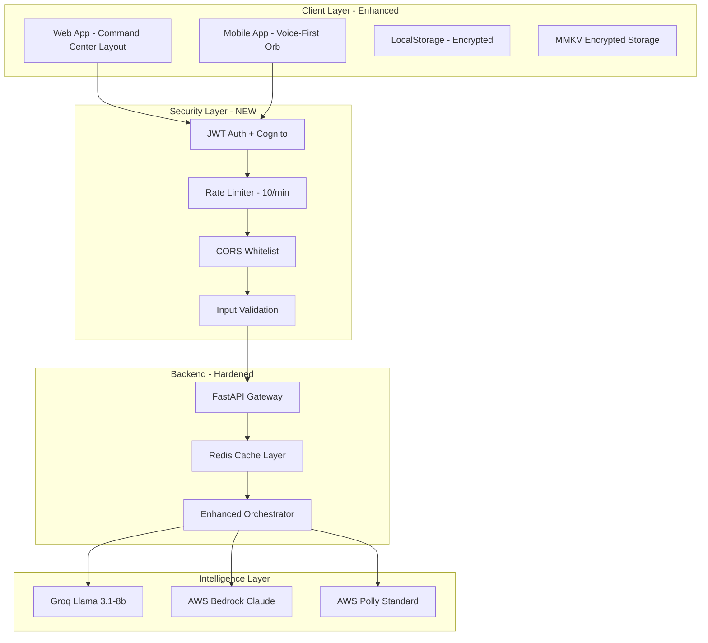
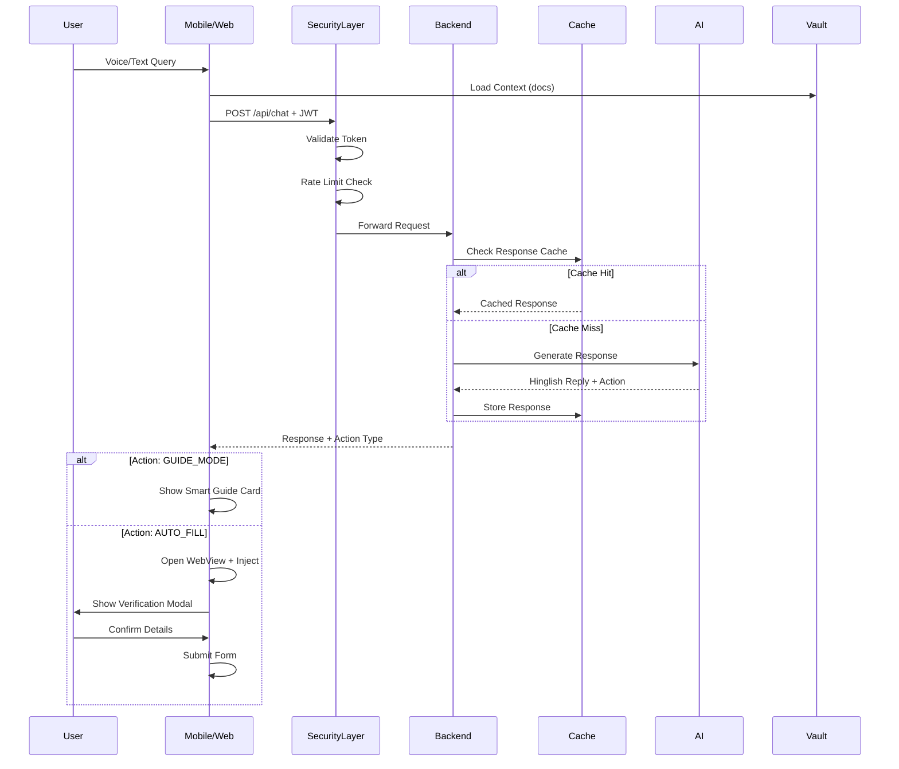

# Design Document: Jan-Sahayak Ideal Product Enhancements

## Overview

This design addresses the critical gaps between the current Jan-Sahayak implementation (34% completion) and the ideal product vision. The system is a privacy-first AI agent for rural India that guides users through government schemes using a zero-knowledge architecture where PII stays on-device while cloud provides intelligence.

The enhancements focus on 7 priority areas: Security Hardening (CRITICAL), Action Layer completion (80% missing), Voice-Native Redesign, Visual Identity Overhaul, Enhanced Agentic Intelligence, Trust & Onboarding, and Responsible AI Safety Net.

## Architecture

### Current vs Ideal System Architecture




## Main Workflow Sequence



## Priority 1: Security Hardening (CRITICAL)

### Components and Interfaces

#### 1.1 CORS Configuration

**Purpose**: Restrict API access to whitelisted origins only

**Interface**:
```python
class CORSConfig:
    allowed_origins: List[str]
    allow_credentials: bool
    allowed_methods: List[str]
    allowed_headers: List[str]
```

**Implementation**:
```python
# backend/config.py
from typing import List
from pydantic import BaseSettings

class Settings(BaseSettings):
    # CORS Configuration
    CORS_ORIGINS: List[str] = [
        "https://jan-sahayak.com",
        "https://www.jan-sahayak.com",
        "https://app.jan-sahayak.com"
    ]
    CORS_ORIGINS_DEV: List[str] = [
        "http://localhost:3000",
        "http://localhost:5173",
        "http://10.0.2.2:3000"  # Android emulator
    ]
    
    def get_cors_origins(self) -> List[str]:
        if self.ENVIRONMENT == "production":
            return self.CORS_ORIGINS
        return self.CORS_ORIGINS + self.CORS_ORIGINS_DEV

# backend/main.py
from fastapi.middleware.cors import CORSMiddleware

settings = Settings()

app.add_middleware(
    CORSMiddleware,
    allow_origins=settings.get_cors_origins(),
    allow_credentials=True,
    allow_methods=["GET", "POST"],
    allow_headers=["Content-Type", "Authorization"],
)
```

**Preconditions**:
- Environment variable ENVIRONMENT is set to "production" or "development"
- CORS_ORIGINS contains valid HTTPS URLs for production

**Postconditions**:
- Only whitelisted origins can access API
- Credentials (cookies, auth headers) are allowed
- Only GET and POST methods are permitted


#### 1.2 MMKV Encrypted Storage (Mobile)

**Purpose**: Replace AsyncStorage with encrypted MMKV for secure local vault

**Interface**:
```typescript
interface SecureStorage {
  set(key: string, value: string): void
  get(key: string): string | undefined
  delete(key: string): void
  clearAll(): void
}

interface VaultDocument {
  id: string
  type: string
  verified: boolean
  timestamp: number
  metadata?: Record<string, any>
}
```

**Implementation**:
```javascript
// mobile/storage/SecureVault.js
import { MMKV } from 'react-native-mmkv';
import { Platform } from 'react-native';

const ENCRYPTION_KEY = 'jan-sahayak-vault-key-v1';
const VAULT_KEY = 'jan_sahayak_vault';

export const storage = new MMKV({
  id: 'jan-sahayak-vault',
  encryptionKey: ENCRYPTION_KEY,
});

export const SecureVault = {
  saveVault: (vaultData) => {
    storage.set(VAULT_KEY, JSON.stringify(vaultData));
  },
  
  loadVault: () => {
    const data = storage.getString(VAULT_KEY);
    return data ? JSON.parse(data) : [];
  },
  
  addDocument: (doc) => {
    const vault = SecureVault.loadVault();
    vault.push({
      ...doc,
      timestamp: Date.now(),
    });
    SecureVault.saveVault(vault);
  },
  
  removeDocument: (docId) => {
    const vault = SecureVault.loadVault();
    const updated = vault.filter(d => d.id !== docId);
    SecureVault.saveVault(updated);
  },
  
  clearVault: () => {
    storage.delete(VAULT_KEY);
  },
};
```

**Preconditions**:
- MMKV library is installed and linked
- Encryption key is securely generated and stored
- Device supports MMKV (iOS 9+, Android 4.1+)

**Postconditions**:
- All vault data is encrypted at rest
- Data persists across app restarts
- No PII is accessible without app context


#### 1.3 Rate Limiting

**Purpose**: Prevent API abuse and control costs

**Interface**:
```python
class RateLimitConfig:
    requests_per_minute: int
    requests_per_hour: int
    requests_per_day: int
    burst_size: int
```

**Implementation**:
```python
# backend/middleware/rate_limit.py
from slowapi import Limiter, _rate_limit_exceeded_handler
from slowapi.util import get_remote_address
from slowapi.errors import RateLimitExceeded
from fastapi import Request, HTTPException

limiter = Limiter(key_func=get_remote_address)

# backend/main.py
app.state.limiter = limiter
app.add_exception_handler(RateLimitExceeded, _rate_limit_exceeded_handler)

@app.post("/api/chat")
@limiter.limit("10/minute")
@limiter.limit("100/hour")
async def chat_endpoint(request: Request, context: UserContext):
    # Endpoint logic
    pass

@app.post("/api/vision")
@limiter.limit("5/minute")  # More expensive, stricter limit
@limiter.limit("20/hour")
async def vision_endpoint(request: Request, image_data: ImageUpload):
    # Endpoint logic
    pass
```

**Preconditions**:
- slowapi library is installed
- Redis is available for distributed rate limiting (optional)
- Client IP can be reliably extracted

**Postconditions**:
- Requests exceeding limits return 429 status
- Rate limit headers included in response
- Legitimate users not impacted by abuse


#### 1.4 Input Validation

**Purpose**: Prevent injection attacks and resource exhaustion

**Interface**:
```python
from pydantic import BaseModel, Field, validator
from typing import List, Optional

class UserContext(BaseModel):
    query: str = Field(..., min_length=1, max_length=500)
    vault_docs: List[str] = Field(..., max_items=20)
    language: str = Field(default="hinglish")
    enable_audio: bool = Field(default=False)
    
    @validator('vault_docs')
    def validate_vault_docs(cls, v):
        allowed_docs = [
            'aadhar_card', 'land_record_7_12', 'bank_passbook',
            'caste_certificate', 'income_certificate', 'ration_card',
            'previous_year_marksheet', 'fee_receipt', 'education_certificate'
        ]
        for doc in v:
            if doc not in allowed_docs:
                raise ValueError(f'Invalid document type: {doc}')
        return v
    
    @validator('language')
    def validate_language(cls, v):
        allowed = ['hinglish', 'hindi', 'english']
        if v not in allowed:
            raise ValueError(f'Language must be one of {allowed}')
        return v

class ImageUpload(BaseModel):
    image_base64: str = Field(..., max_length=10_000_000)  # ~7MB limit
    document_type: str
    
    @validator('image_base64')
    def validate_base64(cls, v):
        import base64
        try:
            base64.b64decode(v)
        except Exception:
            raise ValueError('Invalid base64 encoding')
        return v
```

**Preconditions**:
- Pydantic models are defined for all endpoints
- FastAPI automatic validation is enabled

**Postconditions**:
- Invalid requests rejected with 422 status
- Clear error messages for validation failures
- No malformed data reaches business logic


#### 1.5 Environment Configuration

**Purpose**: Remove hardcoded URLs and credentials

**Implementation**:
```python
# backend/config.py
from pydantic import BaseSettings
from typing import Optional

class Settings(BaseSettings):
    # Environment
    ENVIRONMENT: str = "development"
    
    # AWS Configuration
    AWS_ACCESS_KEY_ID: str
    AWS_SECRET_ACCESS_KEY: str
    AWS_DEFAULT_REGION: str = "ap-south-1"
    
    # Groq Configuration
    GROQ_API_KEY: str
    
    # Security
    JWT_SECRET_KEY: str
    JWT_ALGORITHM: str = "HS256"
    JWT_EXPIRATION_MINUTES: int = 60
    
    # Rate Limiting
    RATE_LIMIT_PER_MINUTE: int = 10
    RATE_LIMIT_PER_HOUR: int = 100
    
    # Feature Flags
    ENABLE_AUDIO: bool = True
    ENABLE_VISION: bool = True
    ENABLE_WEB_CRAWLER: bool = False
    
    class Config:
        env_file = ".env"
        case_sensitive = True

settings = Settings()
```

```javascript
// mobile/config.js
import Constants from 'expo-constants';

const ENV = {
  dev: {
    apiUrl: 'http://10.0.2.2:8000',
  },
  staging: {
    apiUrl: 'https://staging-api.jan-sahayak.com',
  },
  prod: {
    apiUrl: 'https://api.jan-sahayak.com',
  },
};

const getEnvVars = () => {
  const releaseChannel = Constants.expoConfig?.releaseChannel;
  
  if (releaseChannel === 'prod') return ENV.prod;
  if (releaseChannel === 'staging') return ENV.staging;
  return ENV.dev;
};

export default getEnvVars();
```

```javascript
// frontend/.env.production
VITE_API_URL=https://api.jan-sahayak.com
VITE_ENABLE_ANALYTICS=true

// frontend/src/config.js
export const config = {
  apiUrl: import.meta.env.VITE_API_URL || 'http://localhost:8000',
  enableAnalytics: import.meta.env.VITE_ENABLE_ANALYTICS === 'true',
};
```


## Priority 2: Action Layer (Missing 80%)

### Components and Interfaces

#### 2.1 Smart Guide Cards (Web)

**Purpose**: Transform simple links into rich, actionable guidance

**Interface**:
```typescript
interface GuideCard {
  schemeId: string
  schemeName: string
  officialUrl: string
  steps: GuideStep[]
  estimatedTime: string
  difficulty: 'easy' | 'medium' | 'hard'
}

interface GuideStep {
  stepNumber: number
  title: string
  description: string
  actionType: 'navigate' | 'fill_form' | 'upload' | 'verify'
  requiredDocs?: string[]
}
```

**Implementation**:
```javascript
// frontend/src/components/GuideCard.jsx
import { motion } from 'framer-motion';
import { ExternalLink, CheckCircle, Clock } from 'lucide-react';

export const GuideCard = ({ guide }) => {
  return (
    <motion.div
      initial={{ opacity: 0, y: 20 }}
      animate={{ opacity: 1, y: 0 }}
      className="bg-white rounded-lg border-2 border-gray-200 p-6 shadow-lg"
    >
      {/* Header */}
      <div className="flex items-start justify-between mb-4">
        <div>
          <h3 className="text-xl font-bold text-gray-900">{guide.schemeName}</h3>
          <div className="flex items-center gap-4 mt-2 text-sm text-gray-600">
            <span className="flex items-center gap-1">
              <Clock size={16} />
              {guide.estimatedTime}
            </span>
            <span className={`px-2 py-1 rounded ${
              guide.difficulty === 'easy' ? 'bg-green-100 text-green-800' :
              guide.difficulty === 'medium' ? 'bg-yellow-100 text-yellow-800' :
              'bg-red-100 text-red-800'
            }`}>
              {guide.difficulty}
            </span>
          </div>
        </div>
        <a
          href={guide.officialUrl}
          target="_blank"
          rel="noopener noreferrer"
          className="flex items-center gap-2 px-4 py-2 bg-[#138808] text-white rounded-lg hover:bg-[#0f6906] transition"
        >
          Open Portal
          <ExternalLink size={16} />
        </a>
      </div>

      {/* Steps */}
      <div className="space-y-3">
        {guide.steps.map((step, idx) => (
          <div key={idx} className="flex gap-3">
            <div className="flex-shrink-0 w-8 h-8 rounded-full bg-[#138808] text-white flex items-center justify-center font-bold">
              {step.stepNumber}
            </div>
            <div className="flex-1">
              <h4 className="font-semibold text-gray-900">{step.title}</h4>
              <p className="text-sm text-gray-600 mt-1">{step.description}</p>
              {step.requiredDocs && (
                <div className="flex gap-2 mt-2">
                  {step.requiredDocs.map(doc => (
                    <span key={doc} className="text-xs px-2 py-1 bg-gray-100 rounded">
                      {doc}
                    </span>
                  ))}
                </div>
              )}
            </div>
          </div>
        ))}
      </div>
    </motion.div>
  );
};
```


#### 2.2 WebView Auto-Fill with Verification (Mobile)

**Purpose**: Actual form filling with JavaScript injection and pre-submission verification

**Interface**:
```typescript
interface AutoFillConfig {
  url: string
  fieldMappings: FieldMapping[]
  submitButtonSelector: string
  verificationRequired: boolean
}

interface FieldMapping {
  vaultKey: string
  selector: string
  inputType: 'text' | 'select' | 'radio' | 'checkbox'
  value?: string
}
```

**Implementation**:
```javascript
// mobile/screens/AutoFillScreen.js
import React, { useState, useRef } from 'react';
import { View, StyleSheet, Modal, Text, TouchableOpacity, Alert } from 'react-native';
import { WebView } from 'react-native-webview';
import { SecureVault } from '../storage/SecureVault';

export const AutoFillScreen = ({ route }) => {
  const { schemeUrl, fieldMappings } = route.params;
  const webViewRef = useRef(null);
  const [showVerification, setShowVerification] = useState(false);
  const [filledData, setFilledData] = useState({});
  const [isFormFilled, setIsFormFilled] = useState(false);

  const vault = SecureVault.loadVault();
  
  // Extract data from vault based on mappings
  const extractVaultData = () => {
    const data = {};
    fieldMappings.forEach(mapping => {
      const doc = vault.find(d => d.type === mapping.vaultKey);
      if (doc && doc.metadata) {
        data[mapping.vaultKey] = doc.metadata.value || mapping.value;
      }
    });
    return data;
  };

  // Generate JavaScript injection code
  const generateInjectionScript = (data) => {
    const mappings = fieldMappings.map(mapping => ({
      selector: mapping.selector,
      value: data[mapping.vaultKey] || '',
      type: mapping.inputType,
    }));

    return `
      (function() {
        const mappings = ${JSON.stringify(mappings)};
        const filledFields = [];
        
        mappings.forEach(mapping => {
          const element = document.querySelector(mapping.selector);
          if (element) {
            if (mapping.type === 'text') {
              element.value = mapping.value;
              element.style.border = '2px solid #138808';
              element.style.backgroundColor = '#f0fdf4';
            } else if (mapping.type === 'select') {
              element.value = mapping.value;
              element.style.border = '2px solid #138808';
            }
            filledFields.push({
              selector: mapping.selector,
              value: mapping.value
            });
          }
        });
        
        // Highlight submit button
        const submitBtn = document.querySelector('${fieldMappings[0].submitButtonSelector}');
        if (submitBtn) {
          submitBtn.style.border = '3px solid #138808';
          submitBtn.style.boxShadow = '0 0 10px rgba(19, 136, 8, 0.5)';
        }
        
        window.ReactNativeWebView.postMessage(JSON.stringify({
          type: 'FIELDS_FILLED',
          fields: filledFields
        }));
      })();
    `;
  };

  const handleWebViewMessage = (event) => {
    const message = JSON.parse(event.nativeEvent.data);
    
    if (message.type === 'FIELDS_FILLED') {
      setFilledData(message.fields);
      setIsFormFilled(true);
      // Show verification modal after 1 second
      setTimeout(() => setShowVerification(true), 1000);
    }
  };

  const handleVerificationConfirm = () => {
    setShowVerification(false);
    Alert.alert(
      'Ready to Submit',
      'Please review the form and click the highlighted submit button when ready.',
      [{ text: 'OK' }]
    );
  };

  const vaultData = extractVaultData();

  return (
    <View style={styles.container}>
      <WebView
        ref={webViewRef}
        source={{ uri: schemeUrl }}
        onLoadEnd={() => {
          // Inject script after page loads
          webViewRef.current?.injectJavaScript(generateInjectionScript(vaultData));
        }}
        onMessage={handleWebViewMessage}
        javaScriptEnabled={true}
        domStorageEnabled={true}
      />

      {/* Verification Modal */}
      <Modal
        visible={showVerification}
        transparent={true}
        animationType="slide"
      >
        <View style={styles.modalOverlay}>
          <View style={styles.modalContent}>
            <Text style={styles.modalTitle}>⚠️ Verify Your Details</Text>
            <Text style={styles.modalWarning}>
              Please carefully review the information filled in the form. 
              You are responsible for the accuracy of all details.
            </Text>
            
            <View style={styles.dataPreview}>
              {Object.entries(vaultData).map(([key, value]) => (
                <View key={key} style={styles.dataRow}>
                  <Text style={styles.dataLabel}>{key}:</Text>
                  <Text style={styles.dataValue}>{value}</Text>
                </View>
              ))}
            </View>

            <TouchableOpacity
              style={styles.confirmButton}
              onPress={handleVerificationConfirm}
            >
              <Text style={styles.confirmButtonText}>
                I have verified the details
              </Text>
            </TouchableOpacity>
          </View>
        </View>
      </Modal>
    </View>
  );
};

const styles = StyleSheet.create({
  container: {
    flex: 1,
  },
  modalOverlay: {
    flex: 1,
    backgroundColor: 'rgba(0, 0, 0, 0.7)',
    justifyContent: 'center',
    alignItems: 'center',
  },
  modalContent: {
    backgroundColor: 'white',
    borderRadius: 16,
    padding: 24,
    width: '90%',
    maxHeight: '80%',
  },
  modalTitle: {
    fontSize: 24,
    fontWeight: 'bold',
    marginBottom: 12,
    textAlign: 'center',
  },
  modalWarning: {
    fontSize: 16,
    color: '#666',
    marginBottom: 20,
    textAlign: 'center',
    lineHeight: 24,
  },
  dataPreview: {
    backgroundColor: '#f8fafc',
    borderRadius: 8,
    padding: 16,
    marginBottom: 20,
  },
  dataRow: {
    flexDirection: 'row',
    justifyContent: 'space-between',
    marginBottom: 8,
  },
  dataLabel: {
    fontWeight: '600',
    color: '#333',
  },
  dataValue: {
    color: '#666',
  },
  confirmButton: {
    backgroundColor: '#138808',
    borderRadius: 8,
    padding: 16,
    alignItems: 'center',
  },
  confirmButtonText: {
    color: 'white',
    fontSize: 16,
    fontWeight: 'bold',
  },
});
```

**Preconditions**:
- WebView has loaded the target form page
- Vault contains required document metadata
- Field selectors are valid CSS selectors

**Postconditions**:
- Form fields are filled with vault data
- Filled fields have green border highlighting
- Verification modal shown before submission
- User explicitly confirms data accuracy

